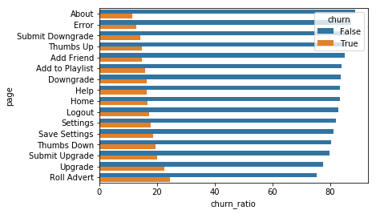
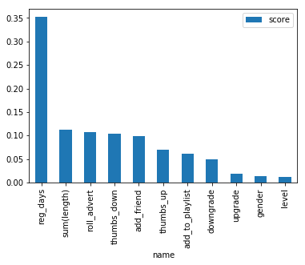

# udacity-dsnd-project4
Udacity Data Science Nanodegree Project 4 (Capstone) - Predicting Churn for Sparkify App

### Table of Contents

1. [Project Overview](#overview)
2. [Data Descriptions](#data)
3. [File Descriptions](#files)
4. [Results and Discussion](#results)
5. [Licensing, Authors, and Acknowledgements](#licensing)

## Project Overview

This project implements [PySpark](https://spark.apache.org/docs/latest/api/python/index.html) to predict churn for a fictional music-streaming app, called Sparkify. Since this problem involves a large dataset, deploying on a cloud platform such as AWS or IBM cloud makes it possible to run the analysis without running into memory errors. This project involves synthesizing a number of different data science tasks, including:
 - *exploratory data analysis and visualization*: since we are given a new dataset without a whole lot of background, a large component of this project is getting a sense of this data and teasing out useful and irrelevant pieces in order to better predict churn
 - *data cleaning*: another important task is cleaning the data - removing null values and un-labeled users, etc.
 - *feature engineering*: once we've gotten a sense for the data and an idea of which variables appear to be more related to churn, we can create features that we'll use in the model
 - *model pipeline*: once we've cleaned the data and engineered some relevant features, the modeling aspect is pretty straightforward -- we will build some machine learning pipelines that assemble and scale the numerical features, and run the model
 - *model evaluation*: since this is an unbalanced dataset, the F1 score (harmonic mean of precision and recall) is better suited for this particular case
 - *model tuning*: finally once we have some baseline models, we can use cross-validation to find the best model parameters, and take a look at feature importances to include only what is needed 

### Problem Domain 

Predicting churn (customer attrition) rates is a common business problem, particularly in subscription-based business models that are increasingly common in our tech-driven world. Fortunately, many companies also collect a large amount of data from their users, including records of the customer's interaction with the app and all the app features. From this data, it is possible to predict which users are more likely to churn, and potentially preempt their cancellation by offering promotions, or addressing issues that may have increased the likelihood of churn. While python, and specifically the pandas library, have a slew of tools for running this sort of analysis on smaller datasets, it is often not enough for large datasets. The Spark framework handles the 

## Data Descriptions 
  
For this analysis I used a small subset of the data (128MB) provided in the Udacity workspace - `mini_sparkify_event_data.json` in order to test `PySpark` on a local machine (I ran all the analysis in the Udacity classroom environment). The data scheme revealed the following contents, which are explored in more detail in the Jupyter Notebook `Sparkify.ipynb`, described in the next section:
  
  - artist: singer user is listening to
  - auth: authentication - whether the user is cancelled, guest, or logged in/out
  - firstName: user's first name
  - gender: user's gender (male, female, null)
  - itemInSession: item id of song in session 
  - lastName: user's last name
  - length: length of song 
  - level: user's subscription level (free or paid)
  - location: user's location
  - method: GET/PULL 
  - page: page user is on / action taken
  - registration: time stamp when user registered 
  - sessionId: id of session
  - song: name of song played
  - status: HTTP status code 
  - ts: timestamp of song
  - userAgent: platform used (web browser & computer)
  - userId: id of user

## File Descriptions 

The repository contains a single jupyter notebook `Sparkify.ipynb` in which the analysis is carried out, based off the template provided in the Udacity workspace. There is a table of contents at the beginning of this notebook that can be used to get to each section.

## Methods

## Results and Discussion

Since my currrent line of work is in aerial mapping and environmental research, I am not as familiar with this sort of business analysis. I did some preliminary research to try and better understand different factors that might play into churn -- this [altexsoft business blog](https://www.altexsoft.com/blog/business/customer-churn-prediction-for-subscription-businesses-using-machine-learning-main-approaches-and-models/) was particularly useful as a starting point. 

Exploratory Data Analysis was a key component to this project - converting the `pyspark` dataframes into `pandas` dataframes, and using the `seaborn` plotting package, I was able to determine some variables from the Sparkify dataset that looked to be related to churn. Specifically the page column contained a lot of potentially useful information -- the figure below shows how churn is related to interactions with various pages, highlighting variables that have low and high correlation with churn. These features ended up being key components in the model. 

In the modeling section I tested out two models, and used the F1-score to evaluate the model performance. The F1-score is the harmonic mean of precision and recall, and is a good metric to use for imbalanced datasets such as this one, where the percentage of users who churn represents a small proportion of the total users. 

1. Logistic Regression: 0.78
2. Random Forest: 0.84

Both of these models performed reasonably well. As an baseline comparison, I calculated the F1 score if I ran a model that just predicted no users churned; this score was 0.66. We can see that both of the models here performed better than this baseline scenario, but this also shows the limits of our model. 

Lastly, I looked at the feature importances of the random forest model to gain a better sense of which factors were most useful in predicting churn.  

The variables included in this graph are explained below:
- `reg_days`: number of days registered
- `sum(length)`: total time listening to songs on the app
- `roll_advert`: count of times user rolled through an advertisement
- `thumbs_down`: count of times user disliked a song
- `add_friend`: count of times user added a friend
- `thumbs_up`: count of times user liked a song
- `add_to_playlist`: count of times user added a song to playlist
- `downgrade`: count of times a user downgraded
- `upgrade`: count of times a user upgraded
- `gender`: gender of user
- `level`: subscription level of user (paid/unpaid)

From this analysis it looks like users who have not been around very long, who have not listened to a lot of songs, who roll through a lot of ads, and who dislike many songs (by selecting the "Thumbs Down") option are among the higher-risk for churn. The other features also come into play, but this analysis indicates that the newer members are worth targeting if they start to have negative interactions with the app pages.

## Licensing, Authors, Acknowledgments 
Data is provided by [Udacity](https://www.udacity.com/). The code here is licensed under open source GNU General Public License v3.0.
